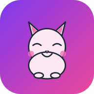

# 🐱 Kids Quest

A cute, mobile-friendly daily activity dashboard for kids — with a cat mascot that changes mood, a parent admin panel, weekly/monthly scoring and PWA support so it works like a real app on iPhone & Android.

Designed to be hosted as a **TrueNAS SCALE Custom App** (or any Docker host).



## ✨ Features

- 👨‍👩‍👧 **Parent panel** — Add kids, set their avatar & theme color, manage tasks
- 📋 **Daily checklist** — Default recurring tasks + extra one-off tasks for specific days
- ✅ **Tap to complete** — Big, kid-friendly checkboxes with confetti for perfect days
- 🐱 **Animated cat mascot** — 6 expressions (sleepy → ecstatic) that react to completion %
- 🏆 **Scoring** — Daily points, weekly/monthly/yearly summary, perfect-day streaks, family leaderboard
- 📱 **PWA** — Install to home screen on iOS/Android, works offline (for already-loaded data)
- 🔒 **Simple PIN auth** — Parent PIN required, optional PIN per kid (so siblings can't ruin each other's score)
- 💾 **SQLite database** — Single file, easy backup, no extra container needed
- 🌙 **Auto daily reset** — At midnight, defaults stay, day-specific tasks expire, fresh slate

## 🚀 Quick start (any Docker host)

```bash
git clone <this-repo>
cd "Task Dashboard"
docker compose up -d
```

Open <http://localhost:3000>.

- Parent username: `parent`
- Default PIN: `1234` *(change it from the ⚙️ Settings menu after first login!)*

## 📦 Deploying on TrueNAS SCALE

TrueNAS SCALE (Electric Eel 24.10+ / Fangtooth 25.04+) supports launching arbitrary Docker images as **Custom Apps**.

### Option A — Use Docker Hub / GHCR (recommended for non-tech users)

1. Build & push the image once from a workstation:
   ```bash
   docker build -t YOUR_DOCKERHUB/kids-quest:latest .
   docker push YOUR_DOCKERHUB/kids-quest:latest
   ```
2. In TrueNAS, go to **Apps → Discover Apps → Custom App** (the three-dot menu).
3. Fill in the form (see below).

### Option B — Build locally on TrueNAS via SSH

SSH into your TrueNAS box and run:

```bash
mkdir -p /mnt/<your-pool>/apps/kids-quest
cd /mnt/<your-pool>/apps/kids-quest
# copy this folder here (rsync / scp / git clone)
docker build -t kids-quest:latest .
```

Then use **Custom App** in the UI and reference `kids-quest:latest`.

### TrueNAS Custom App form

| Field | Value |
|---|---|
| **Application Name** | `kids-quest` |
| **Image repository** | `YOUR_DOCKERHUB/kids-quest` (or `kids-quest`) |
| **Image tag** | `latest` |
| **Container Port** | `3000` |
| **Host Port** | `3000` *(or any free port like `30001`)* |
| **Restart Policy** | `unless-stopped` |

**Environment variables:**

| Name | Example | Notes |
|---|---|---|
| `DEFAULT_PARENT_PIN` | `1234` | Only used on first run when DB is empty |
| `PORT` | `3000` | Internal container port |
| `TZ` | `Asia/Kuala_Lumpur` | Sets daily reset & date display timezone |

**Storage (host path volume):**

| Container Path | Host Path |
|---|---|
| `/data` | `/mnt/<your-pool>/apps/kids-quest/data` |

Deploy. Once the container is healthy, browse to `http://<truenas-ip>:3000`.

## 📱 Installing on phone / tablet

### iPhone / iPad (Safari)
1. Open the URL in Safari.
2. Tap the **Share** button → **Add to Home Screen** → **Add**.
3. The app icon appears on the home screen and launches fullscreen.

### Android (Chrome)
1. Open the URL in Chrome.
2. Tap **⋮** → **Install app** (or **Add to Home Screen**).
3. The app icon appears in your app drawer.

## 🎮 Usage guide

### First time
1. Open the URL → tap **Parent login** → enter PIN (default `1234`).
2. Open **Settings ⚙️** → change the PIN immediately.
3. Tap **+ Add Kid** → choose name, avatar emoji, color, optional PIN.
4. Switch to the **Tasks** tab → select the kid → tap **+ Add 10 Starter Tasks** for a head start, or **+ Add Task** to make your own.

### Adding a one-off task for a specific day
1. Parent panel → **Tasks** tab → **+ Add Task**.
2. Choose **Type: ⭐ One-time** → pick the date.
3. The task appears only on that day.

### Kids using the app
1. Open the URL on their phone/tablet.
2. Tap their profile → enter PIN (if set).
3. Tap each task as they complete it.
4. Watch the cat's expression change → 100% gets confetti!
5. Tap the 🏆 icon to see weekly/monthly scores.

## 🛠️ Local development

```bash
cd backend
npm install
npm run init-db     # one-time
npm run dev         # nodemon, port 3000
```

Browse to <http://localhost:3000>.

## 🗂️ Project structure

```
.
├── Dockerfile              # Single-image production build
├── docker-compose.yml      # For TrueNAS / docker compose
├── backend/
│   ├── package.json
│   └── src/
│       ├── index.js        # Express server + cron jobs
│       ├── middleware/auth.js
│       ├── routes/         # auth, kids, tasks, scores
│       └── utils/initDatabase.js
└── frontend/public/        # Vanilla JS PWA (no build step)
    ├── index.html          # Login / kid dashboard / parent panel
    ├── scores.html         # Weekly/monthly scoring page
    ├── manifest.json       # PWA manifest
    ├── sw.js               # Service worker (offline cache)
    ├── css/styles.css
    └── js/
        ├── app.js          # Main app logic
        ├── scores.js       # Scoring page logic
        └── cat.js          # SVG cat mascot with 6 moods
```

## 💾 Backup

The entire app state lives in **one SQLite file**: `/data/kids_dashboard.db`.

To back up, just copy it (with the WAL file if present):
```bash
cp /mnt/<pool>/apps/kids-quest/data/kids_dashboard.db* ~/backups/
```

To restore, stop the container, replace the file, restart.

## 🔧 Configuration

All settings via environment variables:

| Variable | Default | Description |
|---|---|---|
| `PORT` | `3000` | HTTP port inside container |
| `DB_PATH` | `/data/kids_dashboard.db` | SQLite DB file |
| `STATIC_DIR` | `/app/frontend/public` | Frontend dir served by Express |
| `DEFAULT_PARENT_PIN` | `1234` | Initial parent PIN (first run only) |
| `TZ` | `UTC` | Timezone for daily reset cron |

## 🐛 Troubleshooting

**"No profiles loaded" / blank login screen** — The container can't start. Check `docker logs kids-quest`.

**Forgot parent PIN** — SSH in and run:
```bash
docker exec -it kids-quest sh -c "sqlite3 /data/kids_dashboard.db \"UPDATE users SET pin_hash='' WHERE role='parent';\""
```
Then log in with no PIN and set a new one from Settings.

**Tasks don't reset at midnight** — Check the container's timezone. Add `TZ=Your/Timezone` to env.

**PWA doesn't install on iPhone** — Must be accessed over HTTPS (or `localhost`). For LAN use, an installable PWA on iOS requires HTTPS. Use a reverse proxy (Caddy, Nginx Proxy Manager, etc.) with a self-signed or Let's Encrypt cert.

## 📝 License

MIT — do whatever you want, but no warranty.

---

Made with 💜 for happy mornings.
